# Visual-Systems-Design

#### Aashna Husain : 06067784
#### Marc Zgheib : 06058848

# Artify: Painting Studio
A MATLAB app that transforms photos and live webcam feeds into paintings, with an animated brushstroke timelapse that reveals the artwork stroke by stroke — like watching a real painter at work.

---
## Project Description
The aim of our project was to design an interactive application that is able to perform live painting of stationary images as well as turn live video in to moving art. 


### Interface Overview
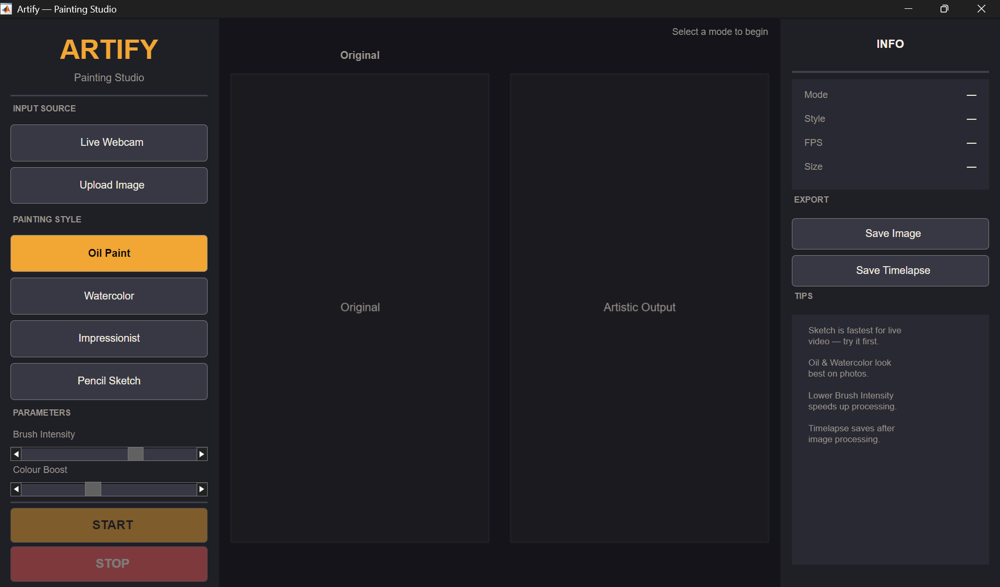
The window is divided into three panels:

<table>
  <tr>
    <th width="40%">Interface View</th>
    <th width="60%">Description</th>
  </tr>
  <tr>
    <td>
      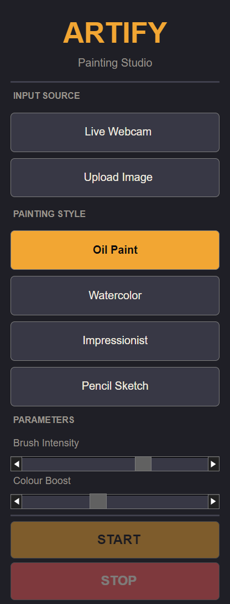
    </td>
    <td>
      <b>Left panel — Controls</b>
      <ul>
        <li>Input source selection (webcam or image upload)</li>
        <li>Painting style selector</li>
        <li>Brush Intensity and Colour Boost sliders</li>
        <li>START / STOP buttons</li>
      </ul>
    </td>
  </tr>
  <tr>
    <td>
      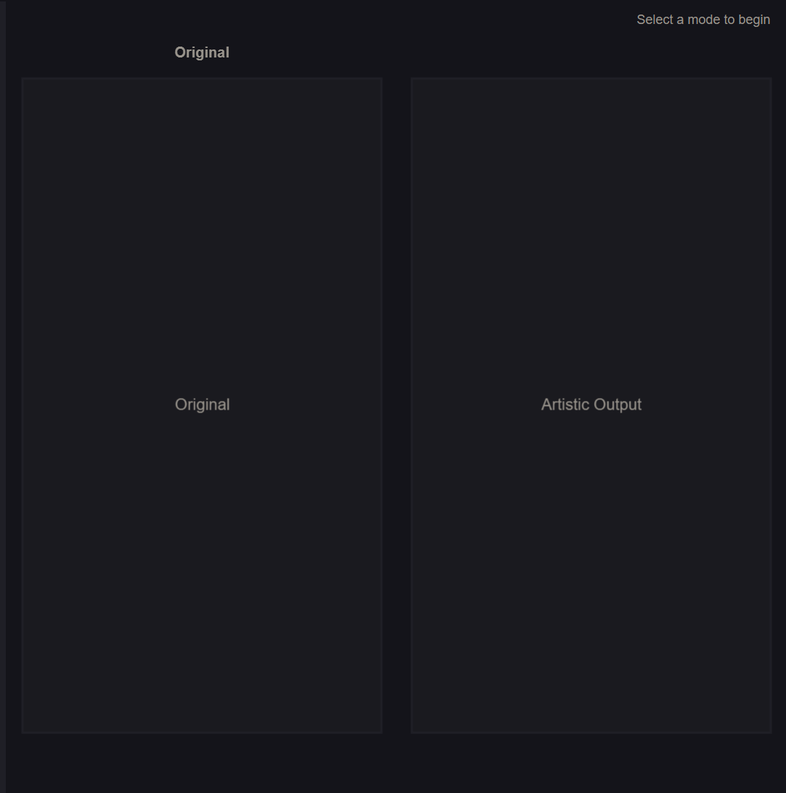
    </td>
    <td>
      <b>Centre panel — Canvas</b>
      <ul>
        <li>Left canvas: original image or live camera feed</li>
        <li>Right canvas: artistic output / painting animation</li>
      </ul>
    </td>
  </tr>
  <tr>
    <td>
      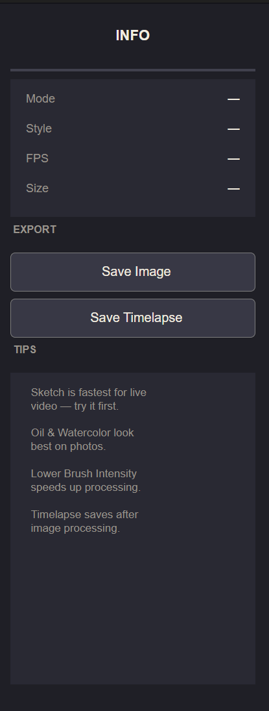
    </td>
    <td>
      <b>Right panel — Info & Export</b>
      <ul>
        <li>Live stats (mode, style, FPS, resolution)</li>
        <li>Save Image and Save Timelapse buttons</li>
        <li>Tips</li>
      </ul>
    </td>
  </tr>
</table>

### Painting Styles

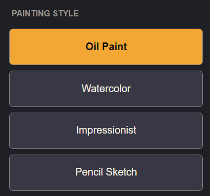

| Style | Description | Best for |
|---|---|---|
| **Oil Paint** | Posterised colour zones with sharp edges and heavy saturation | Portraits, landscapes |
| **Watercolor** | Soft pigment washes, paper grain, gentle blooms | Nature, soft subjects |
| **Impressionist** | Directional colour dabs with warm palette shift | Any subject |
| **Pencil Sketch** | Dodge-based pencil lines with pressure variation and paper texture | Portraits, architecture |

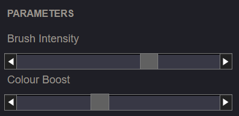

The **Brush Intensity** and **Colour Boost** settings for each style can be personalised using the slidebars under **Parameters**.

### Timelapse Animation

The painting animation works by:
1. Computing the final styled image first
2. Planning ~128 brushstrokes in 3 passes — large background washes first, then medium strokes, then fine detail
3. Stroke angles follow the image's gradient field so strokes flow along natural contours
4. Each stroke is drawn progressively from one end to the other (3 segments per stroke), with a style-specific tool icon at the brush tip:
   - ✏️ Pencil Sketch → animated pencil
   - 🖌 Oil Paint → flat brush
   - 💧 Watercolor → round pointed brush
   - 🎨 Impressionist → fan brush
5. Revealed areas show the actual final painting — no colour approximation
6. At the end, any remaining gaps dissolve smoothly into the final image with an ease-in-out blend


### How to Use

#### Image Upload Mode

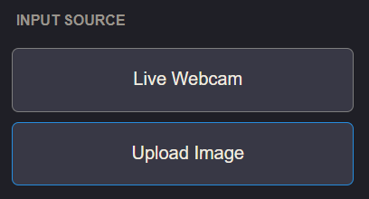

1. Click **Upload Image** and select a photo (JPG, PNG, BMP, or TIFF)
   — the button changes to **Change Image** once a photo is loaded
2. Choose a **Painting Style**
3. Adjust **Brush Intensity** and **Colour Boost** to taste
4. Press **START**

The app will:
- Compute the painted version of your image
- Play an animated timelapse showing a brush progressively painting the canvas stroke by stroke, each stroke drawn from tail to tip with a style-appropriate tool icon following the brush
- Smoothly blend any remaining gaps into the final painting at the end

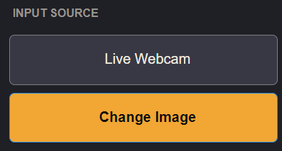

A new image can also be uploaded at any time by pressing on the **Change Image** button.

### Live Webcam Mode

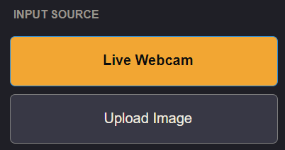

1. Click **Live Webcam**
2. Choose a **Painting Style** (Pencil Sketch is fastest for live use)
3. Press **START** — the right canvas updates in real time
4. Press **STOP** when done

## Export

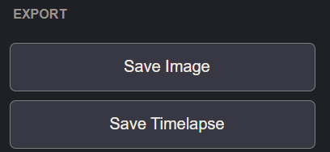

After the timelapse completes:

- **Save Image** — saves the final painted image as PNG or JPG
- **Save Timelapse** — saves the animation as MP4 or AVI video

Both buttons are in the right panel under **EXPORT**.

## Tips

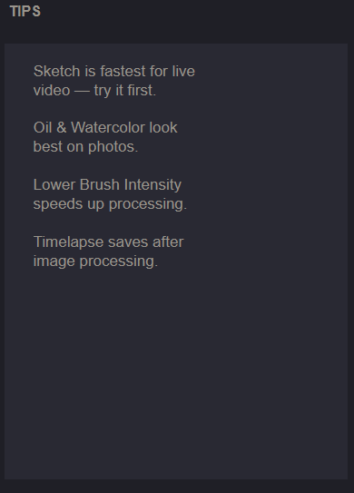

- Lower **Brush Intensity** speeds up processing and gives thinner strokes
- **Pencil Sketch** is the fastest style for live webcam use
- **Oil Paint** and **Watercolor** look best on photos with strong colours
- Images are automatically capped at 640px for performance — the app stays smooth on most hardware
- You can press **STOP** at any point during the timelapse to halt the animation

---
## Instructions

### Requirements

| Requirement | Details |
|---|---|
| MATLAB | R2019b or newer |
| Image Processing Toolbox | Required for all modes |
| Computer Vision Toolbox | Required for Live Webcam mode only |

---

### Installation & Launch

1. Place both files in the same folder:
   - `ArtifyApp.m`
   - `ArtifyUI.m`

2. In MATLAB, navigate to that folder and run:
```matlab
ArtifyApp
```

The app launches maximised and is ready to use.

---


## Evidence

### Live Webcam to Artified Image

Video Proof: logbook/ProjectArtify/livevideoproof.mp4 (https://youtu.be/fjStmO4bL64)


<table style="width: 100%; border-collapse: collapse;">
  <tr>
    <td align="center" style="border: none;">
      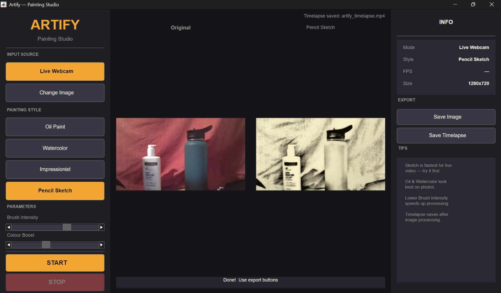<br />
      <b>Artify Live Webcam</b>
    </td>
    <td align="center" style="border: none;">
      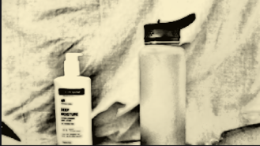<br />
      <b>Artified Image from Live Webcam (Sketch Style)</b>
    </td>
  </tr>
</table>

### Image to Artified Image with Timelapse Video

## Evaluation


## Personal Statements
Each member provides a person statement declaring what you personally have contributed to the project, a reflection section on what you have learned, reasons for your design decisions, mistakes you have made and what you would do differently if you were to do this again.


A folder that contains all the code that your team has developed to implement the application.
