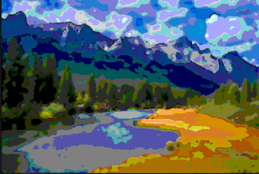
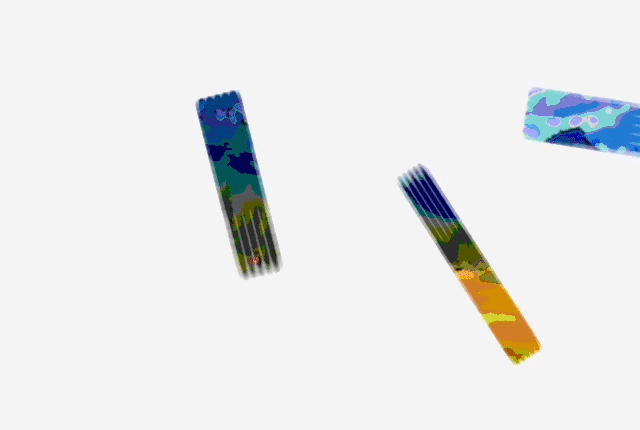
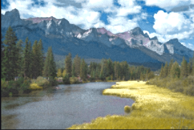
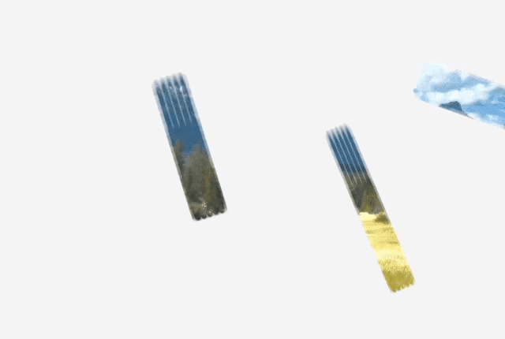
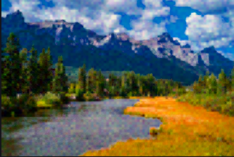
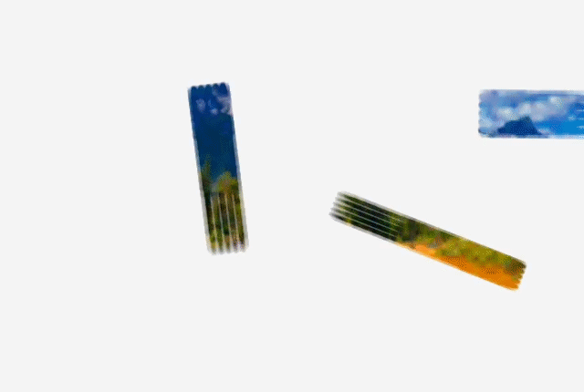
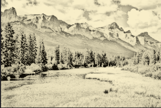
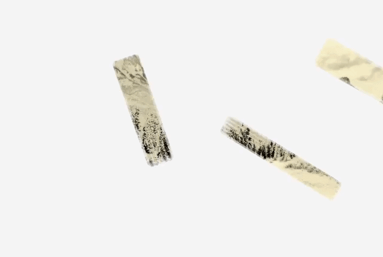

# Visual-Systems-Design

#### Aashna Husain : 06067784
#### Marc Zgheib : 06058848

# Artify: Painting Studio
A MATLAB app that transforms photos and live webcam feeds into paintings, with an animated brushstroke timelapse that reveals the artwork stroke by stroke — like watching a real painter at work.


MATLAB file location: 
```
logbook/ProjectArtify/Artify.m
```

---
## Project Description
The aim of our project was to design an interactive application that is able to perform live painting of stationary images with the options to save both the artified image and the timelapse video of the painting process, as well as turn live video in to moving art, which can be saved as images.


### Interface Overview

The window is divided into three panels:

<table>
  <tr>
    <th width="40%">Interface View</th>
    <th width="60%">Description</th>
  </tr>
  <tr>
    <td>
      
    </td>
    <td>
      <b>Left panel — Controls</b>
      <ul>
        <li>Input source selection (webcam or image upload)</li>
        <li>Painting style selector</li>
        <li>Brush Intensity and Colour Boost sliders</li>
        <li>START / STOP buttons</li>
      </ul>
    </td>
  </tr>
  <tr>
    <td>
      
    </td>
    <td>
      <b>Centre panel — Canvas</b>
      <ul>
        <li>Left canvas: original image or live camera feed</li>
        <li>Right canvas: artistic output / painting animation</li>
      </ul>
    </td>
  </tr>
  <tr>
    <td>
      
    </td>
    <td>
      <b>Right panel — Info & Export</b>
      <ul>
        <li>Live stats (mode, style, FPS, resolution)</li>
        <li>Save Image and Save Timelapse buttons</li>
        <li>Tips</li>
      </ul>
    </td>
  </tr>
</table>

### Painting Styles


| Style | Description | Best for |
|---|---|---|
| **Oil Paint** | Posterised colour zones with sharp edges and heavy saturation | Portraits, landscapes |
| **Watercolor** | Soft pigment washes, paper grain, gentle blooms | Nature, soft subjects |
| **Impressionist** | Directional colour dabs with warm palette shift | Any subject |
| **Pencil Sketch** | Dodge-based pencil lines with pressure variation and paper texture | Portraits, architecture |


The **Brush Intensity** and **Colour Boost** settings for each style can be personalised using the slidebars under **Parameters**.

### Timelapse Animation

The painting animation works by:
1. Computing the final styled image first
2. Planning ~128 brushstrokes in 3 passes — large background washes first, then medium strokes, then fine detail
3. Stroke angles follow the image's gradient field so strokes flow along natural contours
4. Each stroke is drawn progressively from one end to the other (3 segments per stroke), with a style-specific tool icon at the brush tip:
   - ✏️ Pencil Sketch → animated pencil
   - 🖌 Oil Paint → flat brush
   - 💧 Watercolor → round pointed brush
   - 🎨 Impressionist → fan brush
5. Revealed areas show the actual final painting — no colour approximation
6. At the end, any remaining gaps dissolve smoothly into the final image with an ease-in-out blend


### How to Use

#### Image Upload Mode


1. Click **Upload Image** and select a photo (JPG, PNG, BMP, or TIFF)
   — the button changes to **Change Image** once a photo is loaded
2. Choose a **Painting Style**
3. Adjust **Brush Intensity** and **Colour Boost** to taste
4. Press **START**

The app will:
- Compute the painted version of your image
- Play an animated timelapse showing a brush progressively painting the canvas stroke by stroke, each stroke drawn from tail to tip with a style-appropriate tool icon following the brush
- Smoothly blend any remaining gaps into the final painting at the end


A new image can also be uploaded at any time by pressing on the **Change Image** button.

#### Live Webcam Mode


1. Click **Live Webcam**
2. Choose a **Painting Style** (Pencil Sketch is fastest for live use)
3. Press **START** — the right canvas updates in real time
4. Press **STOP** when done

#### Export


After the timelapse completes:

- **Save Image** — saves the final painted image as PNG or JPG
- **Save Timelapse** — saves the animation as MP4 or AVI video

Both buttons are in the right panel under **EXPORT**.

#### Tips


- Lower **Brush Intensity** speeds up processing and gives thinner strokes
- **Pencil Sketch** is the fastest style for live webcam use
- **Oil Paint** and **Watercolor** look best on photos with strong colours
- Images are automatically capped at 640px for performance — the app stays smooth on most hardware
- You can press **STOP** at any point during the timelapse to halt the animation

---
## Instructions

### Requirements

| Requirement | Details |
|---|---|
| MATLAB | R2019b or newer |
| Image Processing Toolbox | Required for all modes |
| Computer Vision Toolbox | Required for Live Webcam mode only |

### Installation & Launch

1. Download the MATLAB file
   - `Artify.m``

2. Open MATLAB and run the file


MATLAB file location: 
```
logbook/ProjectArtify/Artify.m
```

## Evidence

### Upload/Change Image Mode

Video Proof: (https://youtu.be/0NzBPbuUXgE)

Video File Location: 
```
logbook/ProjectArtify/image.mp4 
```

#### Oil Paint

<table style="width: 100%; border-collapse: collapse;">
  <tr>
    <td align="center" style="border: none;">
      <br />
      <b>Artify Live Webcam</b>
    </td>
    <td align="center" style="border: none;">
      <br />
      <b> Artified Image - Oil Paint Style </b>
    </td>
  </tr>
</table>



Timelapse File Location: 
```
logbook/ProjectArtify/artify_timelapse1.mp4
```

#### Watercolour

<table style="width: 100%; border-collapse: collapse;">
  <tr>
    <td align="center" style="border: none;">
      <br />
      <b>Artify Live Webcam</b>
    </td>
    <td align="center" style="border: none;">
      <br />
      <b> Artified Image - Watercolour Style </b>
    </td>
  </tr>
</table>



Timelapse File Location: 
```
logbook/ProjectArtify/artify_timelapse2.mp4
```
#### Impressionist

<table style="width: 100%; border-collapse: collapse;">
  <tr>
    <td align="center" style="border: none;">
      <br />
      <b>Artify Live Webcam</b>
    </td>
    <td align="center" style="border: none;">
      <br />
      <b> Artified Image - Impressionist Style </b>
    </td>
  </tr>
</table>



Timelapse File Location: 
```
logbook/ProjectArtify/artify_timelapse3.mp4
```

#### Sketch

<table style="width: 100%; border-collapse: collapse;">
  <tr>
    <td align="center" style="border: none;">
      <br />
      <b>Artify Live Webcam</b>
    </td>
    <td align="center" style="border: none;">
      <br />
      <b> Artified Image - Sketch Style </b>
    </td>
  </tr>
</table>



Timelapse File Location: 
```
logbook/ProjectArtify/artify_timelapse4.mp4
```

### Live Webcam Mode

Video Proof: (https://youtu.be/fjStmO4bL64)

Video File Location: 
```
logbook/ProjectArtify/livevideoproof.mp4
```

<table style="width: 100%; border-collapse: collapse;">
  <tr>
    <td align="center" style="border: none;">
      <br />
      <b>Artify Live Webcam</b>
    </td>
    <td align="center" style="border: none;">
      <br />
      <b>Artified Image from Live Webcam (Sketch Style)</b>
    </td>
  </tr>
</table>

---

## Evaluation
Artify is a MATLAB desktop application that transforms photographs and live webcam feeds into artistic paintings using four distinct visual styles. The application features a dark-themed three-panel GUI, real-time processing, an animated brushstroke timelapse that simulates the painting process and export functionality for both images and timelapse videos.

### Strength and Achievements

**Input Modes**
- Live Webcam Mode
  -  Captures frames from the system webcam at ~12 fps
  -  Processes at 320px width for speed
  -  Upscales result for to ensure better display
  -  Real-time artistic effect applied to every frame using a MATLAB timer
- Image Upload Mode
  - Supports JPG, PNG, BMP, and TIFF formats
  - Images automatically downscaled to 640px max dimension to ensure high performance
  - Upload button changes to 'Change Image' after first load 

**Painting Styles Functions**
- Oil Paint
  - posterised flat colour zones
  - edge detection outlines burned back in
  - high saturation
  - simulates thick layered pigment
- Watercolour
  - HSV-space colour quantisation into wash regions
  - paper grain texture
  - soft pigment pooling at edges
  - white paper bleed in highlights
- Impressionist
  - tiled colour dab canvas
  - dual directional motion blur at 35° and 125°
  - warm palette shift
  - strong saturation boost
- Sketch
  - dodge-based line extraction
  - spatial warp for hand tremor imitation
  - pressure variation noise
  - shading layer with smudging
  - warm cream paper tint

**Brushstroke Timelapse Features**
- 128 strokes planned in 3 passes:
  - 18 large background washes
  - 40 medium strokes
  - 70 fine detail strokes
- Stroke angles follow the Sobel gradient field of the final image
  - ensure strokes align with natural contours
- Each stroke is progressively drawn from tail to tip over 3 timer ticks
  - a style-appropriate animated tool icon following the brush tip is used
- The final painted image is hidden underneath a mask
  - strokes unmask it region by region to ensure colours are always correct
- Ends with a 25-step ease-in-out blend into the final image
  - ensures remaining gaps are filled 

**Tool Icons**
- Pencil Sketch: animated pencil with yellow body, wood taper, graphite tip and pink eraser
- Oil Paint: flat rectangular bristle head with ferrule and wooden handle
- Watercolor: round tapered brush with pointed tip, blue handle
- Impressionist: fan brush with 7 splayed tines

**Export Functions**
- Save Image
  - captures the current artistic output canvas as PNG or JPG
- Save Timelapse
  - exports the full animation (stroke frames + fade frames) as MP4 or AVI at 24 fps

#### Performance
- All image effects are fully vectorised, thus needing no pixel-by-pixel loops
- Each effect operates on full image matrices using MATLAB's built-in array operations, edge filters and colour space transforms
- The timelapse system is timer-driven rather than loop-driven, meaning MATLAB returns to its event queue between each stroke tick, guaranteeing every frame is rendered to screen without batching.

Key design decisions made to ensure high performance:
- Webcam mode processes at 320px (not full resolution)
  - upscales only for display
- Brushstroke rendering uses a tight rotated bounding box per stroke
  - only the affected pixels are touched
- The per-tick composite redraws only the dirty region of the current stroke
  - not redrawn on the full image
- Image display during the timelapse uses CData updates on a pre-created image handle
  - not based on repeated imshow calls

#### Limitations & Potential Improvements
- Have to wait for the whole process to finish before seeing the final image, makes it time consuming to personalise the colour boost and brush intensity settings
  - a quick preview image should pop-up before the image starts processing
- Watercolor and Impressionist effects could be more photorealistic
  - can be achieved with longer processing times (e.g., using Kuwahara filter for oil paint and diffusion for watercolor)
- Stroke placement is random within gradient-aligned angles not and could be made to be more natural and realistic
  - implementing a smarter algorithm that could sample colours from underpainting regions
- Webcam performance drops with complex styles like Oil Paint and Watercolor)
  - addition of style-specific resolution caps
- No undo functionality, once processing starts, the only option is STOP
  - inclucing undo and redo buttons
- Timelapse does not cover 100% of pixels by strokes alone
  - for full coverage, gap-fill fade is needed
- Only images captured during live webcam can be artified not the entire recording, and there is no option to save the original picture that was captured for artification
  - having an option to record video through the live webcam and convert the entire video into an artified video

#### Summary 
Artify successfully delivers a functional painting studio application within MATLAB. The interface looks professional and is responsive with the four painting styles being able to produce visually distinct outputs. The animated timelapse feature also provides an engaging simulation of the painting process. Moreover, the most technically challenging component — the reveal-mask timelapse feature — effectively solves the core problem of showing correct colours during animation without a jarring cut to the final image. The application however can be improved through the addition of other buttons such as redo, undo and preview image button. The process of artifying the images can also be improved to result in more photorealistic outputs, as well as showing a more natural painting process for the timelapse feature. 


## Personal Statements
### Aashna Husain
#### Role: Live Webcam and GitHub report writing

My main contribution for the MATLAB aspect of the project was converting webcam footage to be displayed as artified live footage with the option of saving a final captured image. Initially I tried using a blocking while loop however, it resulted in some frames getting skipped, thus ruining final image. I had to figure out how to bridge the gap between MATLAB’s webcam object and the artistic filters without the app crashing. I implemented a timer object to handle the 0.028-second period (12 FPS) and wrote the logic that downscales the live feed to 320px for processing. Outside of the code, I managed the GitHub repository and wrote this README report.

The biggest driving factor for my design decisions was performance. When I tried running the "Watercolor" style on a full HD webcam feed, the GUI would hang for 2 seconds per frame. In order to find a solution to this problem, I attempted to first downscale the input image for processing followed by uplscaling again for final output. By shrinking the frame to 320px, the math became 4x faster, which made the "Live Mode" actually usable for with the UI, even if the output was slightly softer. I learned how to implement a timer object to ensure each tick captures a frame, downscales it to 320px, applies the paint effect, upscales and updates both canvases. I also helped with the masking and revealing final image feature which involved the multiplication of 6 layers inclduing inBox, endTaper, sideT, fray and load to produce the final per-pixel opacity.

My biggest mistake was initially trying to use a while loop for the webcam. It worked in a script, but it locked up the UI, meaning we couldn't click "STOP." I had to rewrite the whole thing using a timer function. If I did this again, I’d try to implement a "low-resolution preview" mode that only processes every other frame to boost the FPS even higher. One of the main things I learned through maintaining the GitHUb repository was the importance of folder hierarchy on GitHub—specifically how case sensitivity can break a README. For the evidence aspect, I had screen recorded interaction with the UI but the files were too big to be uploaded onto this repository. Even after downscaling multiple times, I was not able to embed the videos within this report, thus had to upload the videos separately and add links to YouTube where I uploaded. I also struggled to embed the timelapse videos in this report. However, I was able to mitigate this by converting the short videos to GIF format and embedded those instead while uploading the main videos to the ArtifyProject folder.

Overall, I learned how to manage system resources and how drawnow limit works to keep the UI responsive. A key learning aspect was that a blocking loop with drawnow inside it asks MATLAB to render but MATLAB may defer rendering if the loop is executing faster than the screen refresh, leading to lagging. The solution was implementing a queue for all the events which can be achieved ising a timer object. 

### Marc Zgheib
#### Role: Image to Art and Application UI

I wrote the four core functions (fxOil, fxWatercolor, fxImpressionist, and fxSketch) and built the Stroke-Based Rendering (SBR) engine. I used Sobel filters to calculate image gradients so the brushstrokes would actually follow the shapes in the photo (like the curve of a face) rather than just being random. This led to the timelapse revealing image system being based of 3 steps, state.canvas, state.revealMask and state.finalArt. It also took a lot of time to get the "Watercolor" feature paper grain effect and the "Oil Paint" saturation effect just right using the $L*a*b*$ and $HSV$ color spaces. Finally, I  compiled the final code file and built the tool icons using direct array indexing, as well as developing the User Interface (UI). 

Initially, I relied on looping through every pixel, which showed to be very slow in MATLAB, so instead, I used matrix-wide operations and chose to use Vectorization for everything. A big struggle was making the artified images photorealistic. For the "Pencil Sketch," I decided to add a "Hand Tremor" feature using random spatial displacement, because in my first few attempts the perfectly straight digital lines didn't look like a real drawing. Moreover, in order to implement proper stroke rendering, I learned that a geometric approach had to be taken which involved using a bounding box as well as a local coordinate system.

My first timelapse code had 40 strokes for the export which did not show as a natural painting process. I adapted this to be 128 strokes seperated into 3 categories so the user could see the gradual unfolding of the final artified image. Another struggle was with "Color Clipping", the initial Watercolor code made the images look "burnt" because the values went above 1.0. I had to include a custom clamp01mat function to fix it. If I could go back, I would spend more time on the "Impressionist" style; currently, it’s a bit too reliant on motion blur. I’d love to try a Voronoi-based approach for more geometric art.

Overall, I learned that digital image processing is reliant on some extent of data loss. To make a "Painting," you have to throw away the right details while keeping the edges. The UI development was relatively intuitive and easy to develop as it was built entirely with MATLAB uicontrol and uipanel elements positioned using normalised coordinates (0 to 1) to esnsure  the layout would scale with any window size. I also learned how to use VideoWriter to handle the transition from the painting phase to the final "fade" animation.
