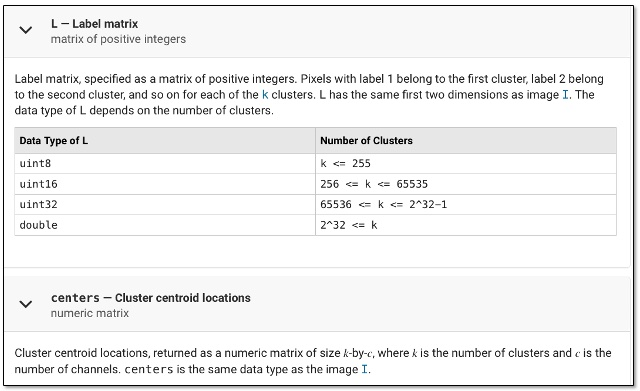

# Lab 5 - Segmentation and Feature Detection
*19 Feb 2026*
## Task 1: Point Detection

The file "crabpulsar.tif" contains an image of the neural star Crab Nebula, which was the remnant of the supernova SN 1054 seen on earth in the year 1054. 

The goal is to try to remove the main nebular and only highlight the surrounding stars seen in the image.

Try the following code and explain what hapens.

```
clear all
close all
f = imread('assets/crabpulsar.tif');
w = [-1 -1 -1;
     -1  8 -1;
     -1 -1 -1];
g1 = abs(imfilter(f, w));     % point detected
se = strel("disk",1);
g2 = imerode(g1, se);         % eroded
threshold = 100;
g3 = uint8((g2 >= threshold)*255); % thresholded
montage({f, g1, g2, g3});
```
### Answers

<p align="center">  </p>

Top Left (Original): Shows the Crab Nebula as a large, bright mass masking smaller background details.

Top Right (g1): The Laplacian mask acts as a high-pass filter, sharpening edges and isolating small stars from the smooth nebula.

Bottom Left (g2): Erosion removes low-intensity artifacts and noise, thinning the remaining detected points.

Bottom Right (g3): Final thresholding creates a high-contrast binary image, successfully isolating the stars while completely removing the nebula.
## Task 2: Edge Detection 

Matlab Image Processing Toolbox provides a special function *_edge( )_* which returns an output image containing edge points.  The general format of this function is:

```
[g, t] = edge(f, 'method', parameters)
```
*_f_* is the input image.  
*_g_* is the output image.  *_t_* is an optional return value giving the threshold being used in the algorithm to produce the output.  
*_'method'_* is one of several algorithm to be used for edge detection.  The table below describes three algorithms we have covered in Lecture 8.

<p align="center">  </p>

The image file *_'circuits.tif'_* is part of a chip micrograph for an intergrated circuit.  The image file *_'brain_tumor.jpg'_* shows a MRI scan of a patient's brain with a tumor.

Use *_function edge( )_* and the three methods: Sobel, LoG and Canny, to extract edges from these two images.

The function *_edge_* allows the user to specify one or more threshold values with the optional input *_parameter_* to control the sensitivity to edges being detected.  The table below explains the meaning of the threshold parameters that one may use.

<p align="center">  </p>

Repeat the edge detection exercise with different threshold to get the best results you can for these two images.

### Answers

<p align="center">  </p>

Sobel: As expected, it captured the strongest gradients but appears slightly broken or "blocky" on the brain's subtle curves.

LoG: This method produced more complete, continuous contours than Sobel, especially in the circuit tracks.

Canny: This provided the best result, yielding thin, well-defined, and continuous edges for both the circuit and the tumor boundary.

Comparison: The Canny operator is clearly superior here as it manages to ignore noise while connecting edge segments that the other two methods missed.


## Task 3 - Hough Transform for Line Detection

In this task, you will be lead through the process of finding lines in an image using Hough Transform.  This task consists of 5 separate steps.


#### Step 1: Find edge points
Read the image from file 'circuit_rotated.tif' and produce an edge point image which feeds the Hough Transform.

```
% Read image and find edge points
clear all; close all;
f = imread('assets/circuit_rotated.tif');
fEdge = edge(f,'Canny');
figure(1)
montage({f,fEdge})
```
This is the same image as that used in Task 2, but rotated by 33 degrees.
### Answers
<p align="center">  </p>
Rotation: The input image is the same integrated circuit from Task 2 but oriented at a 33 degree angle.
Edge Quality: The Canny operator is used because the Hough Transform requires thin, single pixel edge points to accurately populate the parameter space (rho, theta).
Preparation: By isolating only the structural boundaries, we remove unnecessary surface texture that could create false lines during the transform.


#### Step 2: Do the Hough Transform
Now perform the Hough Transform with the function *_hough( )_* which has the format:
```
[H, theta, rho] = hough(image)
```
where *_image_* is the input grayscale image, *_theta_* and *_rho_* are the angle and distance in the transformed parameter space, and *_H_* is the number of times that a pixel from the image falls on this parameter "bin".  Therefore, the bins at (theta,rho) coordinate with high count values belong to a line.  (See Lecture 8, slides 19-25.)  The diagram below shows the geometric relation of *_theta_* and *_rho_* to a straight line.

<p align="center">  </p>

Now perform Hough Transform in Matlab:
```
% Perform Hough Transform and plot count as image intensity
[H, theta, rho] = hough(fEdge);
figure(2)
imshow(H,[],'XData',theta,'YData', rho, ...
            'InitialMagnification','fit');
xlabel('theta'), ylabel('rho');
axis on, axis normal, hold on;
```

The image, which I shall called the **_Hough Image_**, correspond to the counts in the Hough transform parameter domain with the intensity representing the count value at each bin.  The brighter the point, the more edge points maps to this parameter.  Therefore all edge points on a straight line will map to this parameter bin and increase its brightness.

### Answers
<p align="center">  </p>
Hough Space Representation: The resulting image is the accumulator matrix where the x-axis represents the angle (theta) and the y-axis represents the distance from the origin (rho).
Peak Identification: Bright spots in this Hough Image indicate parameters where many edge points intersect, signifying the presence of a straight line in the original image.
Symmetry and Shape: Since the circuit has many parallel and perpendicular lines, you will notice distinct clusters of bright peaks spaced approximately 90 degrees apart.
Rotation Impact: Because the image is rotated by 33 degrees, the primary peaks will be shifted along the theta axis compared to a standard non-rotated circuit image.


#### Step 3: Find peaks in Hough Image
Matlab  provides a special function **_houghpeaks_** which has the format:
```
peaks = houghpeaks(H, numpeaks)
```
which returns the coordinates of the highest *_numpeaks_* peaks. 

The following Matlab snippet find the 5 tallest peaks in H and return their coordinate values in *_peaks_*.  Each element in *_peaks_* has values which are the indices into the *_theta_* and *_rho_* arrays.  

The *_plot_* function overlay on the Hough image red circles at the 5 peak locations.

```
% Find 5 larges peaks and superimpose markers on Hough image
figure(2)
peaks  = houghpeaks(H,5);
%peaks  = houghpeaks(H,5,'threshold',ceil(0.3*max(H(:))));
x = theta(peaks(:,2)); y = rho(peaks(:,1));
plot(x,y,'o','color','red', 'MarkerSize',10, 'LineWidth',1);
```

> Explore the contents of array *_peaks_* and relate this to the Hough image with the overlay red circles.


### Answers
<p align="center">  </p>
Content of peaks: This is a 5 x 2 matrix where each row contains the row and column indices (r, c) of the accumulator matrix H corresponding to the highest vote counts.
Coordinate Mapping: The indices in peaks are mapped back to physical values using the theta and rho arrays to determine the exact angle and distance of the detected lines.
Significance of the 5 Peaks: These represent the five longest or most prominent straight line segments in the rotated circuit image.
Visual Correlation: The red circles align precisely with the brightest intensity spots in the Hough Image, confirming that the algorithm successfully located the strongest linear features.


#### Step 4: Explore the peaks in the Hough Image
It can be insightful to take a look at the Hough Image in a different way.  Try this:

```
% Plot the Hough image as a 3D plot (called SURF)
figure(3)
surf(theta, rho, H);
xlabel('theta','FontSize',16);
ylabel('rho','FontSize',16)
zlabel('Hough Transform counts','FontSize',16)
```
You will see a plot of the Hough counts in the parameter space as a 3D plot instead of an image.  You can use the mouse (or track pad) to rotate the plot in any directions and have a sense of where the peaks occurs.  The **_houghpeak_** function simply search this profile and fine the highest specified number of peaks.  

### Answers
<p align="center">  </p>
Surface Plot (surf): Unlike the 2D intensity image, the 3D plot represents votes as vertical height (z-axis).
Peak Identification: The five peaks identified in Step 3 correspond to the highest mountains in this 3D topography.
Noise vs. Signal: The valleys represent random edge points or noise, while the sharp spikes represent significant linear alignment in the circuit image.
Rotation Insights: By rotating the plot, you can clearly see how the clusters of peaks are separated by approximately 90 degrees, confirming the rectangular geometry of the circuit traces.


### Step 5: Fit lines into the image

The following Matlab code uses the function **_houghlines_** to 

```
% From theta and rho and plot lines
lines = houghlines(fEdge,theta,rho,peaks,'FillGap',5,'MinLength',7);
figure(4), imshow(f), 
figure(4); hold on
max_len = 0;
for k = 1:length(lines)
   xy = [lines(k).point1; lines(k).point2];
   plot(xy(:,1),xy(:,2),'LineWidth',2,'Color','green');
```

The function **_houghlines( )_** returns arrays of lines, which is a structure including details of line segments derived from the results from both **_hough_** and **_houghpeaks_**.  Details are given in the table below.

<p align="center">  </p>

The start and end coordinates of each line segment is used to define the starting and ending point of the line which is plotted as overlay on the image.

> How many line segments are detected? Why it this not 5, the number of peaks found?
> Explore how you may detect more lines and different lines (e.g. those orthogonal to the ones detected).

> Optional: Matlab also provides the function **_imfindcircles( )_**, which uses Hough Transform to detect circles instead of lines.  You are left to explore this yourself.  You will find two relevant image files for cicle detection: *_'circles.tif'_* and *_eight.png_* in the *_assets_* folder.

### Answers
<p align="center">  </p>
Line Segment Count: More than 5 segments are detected because houghlines finds multiple collinear segments (broken lines) that all fall along the same (theta, rho) peak.
Detecting More Lines: Increase the numpeaks in houghpeaks or lower the threshold parameter to capture fainter or shorter line segments.
Detecting Orthogonal Lines: Since the circuit is rectangular, orthogonal lines exist at theta ± 90 degrees; ensuring the peak search covers the full -90 degrees to 89 degrees range will capture them.
Circle Detection: The imfindcircles function works similarly but uses a 3D accumulator (center x, center y, radius) to identify circular features like coins or drill holes.


## Task 4 - Segmentation by Thresholding

You have used Otsu's method to perform thresholding using the function **_graythresh( )_** in Lab 3 Task 3 already.  In this task, you will explore the limitation of Otsu's method.

You will find in the *_assets_* folder the image file *_'yeast_cells.tif'_*. Use Otu's method to segment the image into background and yeast cells.  Find an alternative method to allow you separating those cells that are 'touching'. (See Lecture 9, slide 9.)

### Answers
<p align="center">  </p>
Otsu’s Limitation: It cannot distinguish between individual objects that share a boundary; it only classifies pixels by intensity.
Watershed Advantage: It uses the geometric "distance transform" to find the narrowest points between touching cells and draws a "ridge line" to separate them.
Result: The Watershed method successfully segments individual yeast cells, allowing for more accurate cell counting.
Watershed Result: The colorful labels show that the algorithm successfully identified individual cells.
Separation: By using the distance transform, the method drew "watershed lines" at the narrowest points between touching cells.
Advantage: Unlike Otsu's method, which would treat touching cells as a single clump, this approach allows for accurate individual cell counting.

## Task 5 - Segmentation by k-means clustering

In this task, you will learn to apply k-means clustering method to segment an image.  

Try the following Matlab code:
```
clear all; close all;
f = imread('assets/baboon.png');    % read image
[M N S] = size(f);                  % find image size
F = reshape(f, [M*N S]);            % resize as 1D array of 3 colours
% Separate the three colour channels 
R = F(:,1); G = F(:,2); B = F(:,3);
C = double(F)/255;          % convert to double data type for plotting
figure(1)
scatter3(R, G, B, 1, C);    % scatter plot each pixel as colour dot
xlabel('RED', 'FontSize', 14);
ylabel('GREEN', 'FontSize', 14);
zlabel('BLUE', 'FontSize', 14);
```

This code reproduces the scatter plot in Lecture 9 slide 12, but in higher resolution.  Each dot and its colour in the plot corresponds to a pixel with it [R G B] vector on the XYZ axes.  The Matlab function **_scatter3( )_** produces the nice 3D plot.  
The first three inputs R, G and B are the X, Y and Z coordinates. The fourth input '1' is the size of the circle (i.e. a dot!).  The final input  is the colour of each pixel.

Note that **_scatter3( )_** expects the X, Y and Z coordinates to be 1D vectors.  Therefore the function **_reshape( )_** was used to convert the 2D image in to 1D vector.
> You can use the mouse or trackpad to move the scatter plot to different viewing angles or to zoom into the plot itself. Try it.

Matlab provides a built-in function **_imsegkmeans_** that perform k-means segmentation on an image.  This is not a general k-means algorithm in the sense that it expects the input to be a 2D image of grayscale intensity, or a 2D image of colour.  The format is:

```
[L, centers] = imsegkmeans(I, k)
```
where **_I_** is the input image, **_k_** is the number of clusters, **_L_** is the label matrix as described in the table below.  Each element of **_L_** contains the label for the pixel in **_I_**, which is the cluster index that pixel belongs.  **_centers_** contains the mean values for the k clusters.

<p align="center">  </p>

### Answers
<p align="center">  </p>
Color Space Grouping: The 3D scatter plot shows that the baboon image contains distinct clusters of colors (for example the blues of the face, the reds of the nose, and the browns of the fur).
Cluster Meanings: When k = 3 is used, the algorithm merges similar shades into three dominant groups, simplifying the complex image into a high contrast map.
Segmentation Logic: Pixels that are far apart in the image but similar in color (like two different patches of fur) are assigned the same label in matrix L.
Visual Output: The label2rgb result shows solid blocks of color, demonstrating that K-means is an effective tool for separating an object from its background based solely on chromatic data.
Efficiency: K-means is faster than manual thresholding for multi colored images.
Limitation: It ignores the spatial location of pixels, meaning two identical colors in different parts of the image will always be placed in the same cluster.


```
% perform k-means clustering
k = 10;
[L,centers]=imsegkmeans(f,k);
% plot the means on the scatter plot
hold
scatter3(centers(:,1),centers(:,2),centers(:,3),100,'black','fill');
```
The last line here superimposes a large black circle at each means colour values in the scatter plot.

> Explore the outputs **_L_** and **_centers_** from the segmentation fucntion.  Explore different value of k.

Finally, use the label matrix **_L_** to segment the image into the k colours:
```
% display the segmented image along with the original
J = label2rgb(L,im2double(centers));
figure(2)
montage({f,J})
```

The Matlab function **_labe2rgb_** turns each element in **_L_** into the segmented colour stored in **_centers_**.

> Explore different value of k and comment on the results.
> Also, try segmenting the colourful image file 'assets/peppers.png'.
> 
### Answers
<p align="center">  </p>
Scatter Plot Centers: The large black circles represent the centroids of each cluster. They mark the average RGB value that best represents all pixels within that specific group.
Effect of k:
Small k (e.g., 2–3): Produces a highly simplified image, useful for separating foreground (peppers) from background, but loses texture.
Large k (e.g., 10–20): Preserves more detail and shading, but the segmentation becomes less distinct as color groups begin to overlap.
Output L and centers: L acts as a spatial map of cluster assignments, while centers provides the actual RGB values used to recolor the image in the final montage.
Peppers Analysis: Because the peppers have distinct, vibrant colors (red, green, yellow), K-means is highly effective at isolating each individual vegetable into its own segment.


## Task 6 - Watershed Segmentation with Distance Transform

Below is an image of a collections of dowels viewed ends-on. The objective is to segment this into regions, with each region containing only one dowel.  Touch dowels should also be separated.
<p align="center">  </p>
This image is  suitable for watershed algorithm because touch dowels will often be merged into one object. This is not the case with watershed segmentation.

Read the image and produce a cleaned version of binary image having the dowels as foreground and cloth underneath as background.  Note how morophological operations are used to reduce the "noise" in grayscale image.  The "noise" is the result of thresholding on the pattern of the wood.

```
% Watershed segmentation with Distance Transform
clear all; close all;
I = imread('assets/dowels.tif');
f = im2bw(I, graythresh(I));
g = bwmorph(f, "close", 1);
g = bwmorph(g, "open", 1);
montage({I,g});
title('Original & binarized cleaned image')
```
### Answers
<p align="center">  </p>
Binarization: Using graythresh and im2bw isolates the light wooden dowels from the dark background, though the wood grain creates holes (noise) inside the shapes.
Morphological Closing (g): The bwmorph close operation fills the internal gaps and wood grain noise, creating solid masks for the dowels.
Morphological Opening (g): This operation smooths the exterior boundaries and removes small unwanted background artifacts.
Limitation: While the shapes are cleaned, the touching dowels remain connected as single merged components in this binary mask.


Instead of applying watershed transform on this binary image directly, a technique often used with watershed is to first calculate the distance transform of this binary image. The distance transform is simply the distance from every pixel to the nearest nonzero-valued (foreground) pixel.  Matlab provides the function **_bwdist( )_** to return an image where the intensity is the distance of each pixel to the nearest foreground (white) pixel.  

```
% calculate the distance transform image
gc = imcomplement(g);
D = bwdist(gc);
figure(2)
imshow(D,[min(D(:)) max(D(:))])
title('Distance Transform')
```
> Why do we perform the distance transform on gc and not on g?

### Answers
<p align="center">  </p>
Purpose: The distance transform converts the binary shapes into a topographic map where intensity represents depth.
Complementing (gc): We complement the image so that the dowels become background (zeros), allowing bwdist to calculate how far each pixel inside the dowel is from the edge.
Resulting Peaks: The centers of the dowels appear as the brightest points because they are the furthest from the cloth.
Functionality: These peaks serve as the catchment basins that guide the Watershed algorithm to find the exact center of each object for separation.
Why do we perform the distance transform on gc and not on g?: The bwdist function computes the distance from each pixel to the nearest non-zero pixel, and by using gc (where the background is white and the dowels are black), the distance increases toward the dowel centers, creating bright peaks that help the watershed algorithm separate individual objects.


Note that the **_imshow_** function has a second parameter which stretches the distance transform image over the full range of the grayscale.

Now do the watershed transform on the distance image.

```
% perform watershed on the complement of the distance transform image
L = watershed(imcomplement(D));
figure(3)
imshow(L, [0 max(L(:))])
title('Watershed Segemented Label')
```
> Make sure you understand the image presented. Why is this appears as a grayscale going from dark to light from left the right? 

### Answers
<p align="center">  </p>
Label Matrix: The watershed function assigns a unique integer ID to every isolated region it discovers.
Intensity Gradient: The image looks darker on the left and brighter on the right because the regions are numbered sequentially (1, 2, 3...).
Boundary Detection: It identifies the exact ridge lines where two expanding regions meet, assigning them a value of 0.
Object Separation: This step successfully treats the merged blobs as separate entities, which is the core goal of the task.
Why is this appears as a grayscale going from dark to light from left the right? : The grayscale gradient appears because the watershed function assigns sequential numeric labels to regions, and imshow displays these label values as different brightness levels.


```
% Merge everything to show segmentation
W = (L==0);
g2 = g | W;
figure(4)
montage({I, g, W, g2}, 'size', [2 2]);
title('Original Image - Binarized Image - Watershed regions - Merged dowels and segmented boundaries')
```
> Explain the montage in this last step.

### Answers
<p align="center">  </p>
Process Verification: The montage displays the progression from the raw image to the successfully segmented result.
Original vs. Binary: It highlights how standard thresholding (g) fails to separate touching dowels, treating them as a single mass.
Watershed Lines (W): These represent the mathematical cuts made at the narrowest points between objects, effectively separating the merged blobs.
Integrated Result (g2): By merging the binary mask with the ridge lines, the final image shows each dowel as an isolated region, ready for counting or analysis.
Final Conclusion for Task 6: The combination of morphological operations to clean noise, distance transform to find object centers, and watershed segmentation to find boundaries is a robust method for separating touching objects that simple thresholding cannot handle.


## Challenges

You are not required to complete all challenges.  Do as many as you can given the time contraints.
1. The file **_'assets/random_matches.tif'_** is an image of matches in different orientations.  Perform edge detection on this image so that all the matches are identified.  Count the matches.
   
2. The file **_'assets/f14.png'_** is an image of the F14 fighter jet.  Produce a binary image where only the fighter jet is shown as white and the rest of the image is black.
   
3. The file **_'assets/airport.tif'_** is an aerial photograph of an airport.  Use Hough Transform to extract the main runway and report its length in number of pixel unit.  Remember that because the runway is at an angle, the number of pixels it spans is NOT the dimension.  A line at 45 degree of 100 pixels is LONGER than a horizontal line of the same number of pixels.
   
4. Use k-means clustering, perform segmentation on the file **_'assets/peppers.png'_**.
