# Lab 6 - Feature Matching and Classification

**5 March 2026**

## Task 1: Image resizing

The following image is the famous painting by van Gogh called 'Cafe Terrace at Night', which can be found in the file *_'cafe_van_gogh.jpg'_* in the _'assets'_ folder.  

<p align="center">  </p>

>Write a Matlab program to read this file and build the image pyramid by resize the image by a factor of 1/2, 1/4, 1/8, 1/16 and 1/32 by drop every other rows and columns.  Then display all six images as a montage of size [2 3]. 

To drop every other rows and columns in an image, you can use this Matlab syntax: (start: increment: end) to slice the matrix.  Try this Matlab command:

```
1:2:10
1:3:10
```
The first command returns the values: 1, 3, 5, 7 and 9.
The second command returns the values: 1, 4, 7, 10.

Matlab provides a proper image resizign function **_imresize(I, scale)_** where I is the input image and scale is the factor to resize.  So 0.5 means the image is reduced by a factor of 2. This function first filter the image by a lowpass filter (Gaussian) that removes the high frequency components before subsampling by skipping pixels.  This prevents aliasing and the introdduction of artifacts.

>Repeat the above exercise by adding code to properly resize the image with the **_imresize_** function.

Compare the results from the two approach to subsampling.


#### Answers

##### Our Solution
```
clear; close all; clc;

I = imread('cafe_van_gogh.jpg');

I1 = I;                           % original
I2 = I1(1:2:end, 1:2:end, :);     % 1/2
I3 = I1(1:4:end, 1:4:end, :);     % 1/4
I4 = I1(1:8:end, 1:8:end, :);     % 1/8
I5 = I1(1:16:end,1:16:end,:);     % 1/16
I6 = I1(1:32:end,1:32:end,:);     % 1/32

figure;
montage({I1,I2,I3,I4,I5,I6},'Size',[2 3]);
title('Poor subsampling by dropping rows/cols');

clear; close all; clc;

I = imread('cafe_van_gogh.jpg');

I1 = I;
I2 = imresize(I, 0.5);
I3 = imresize(I, 0.25);
I4 = imresize(I, 0.125);
I5 = imresize(I, 0.0625);
I6 = imresize(I, 0.03125);

figure;
montage({I1,I2,I3,I4,I5,I6},'Size',[2 3]);
title('Proper resizing using imresize');
```
<p align="center"> 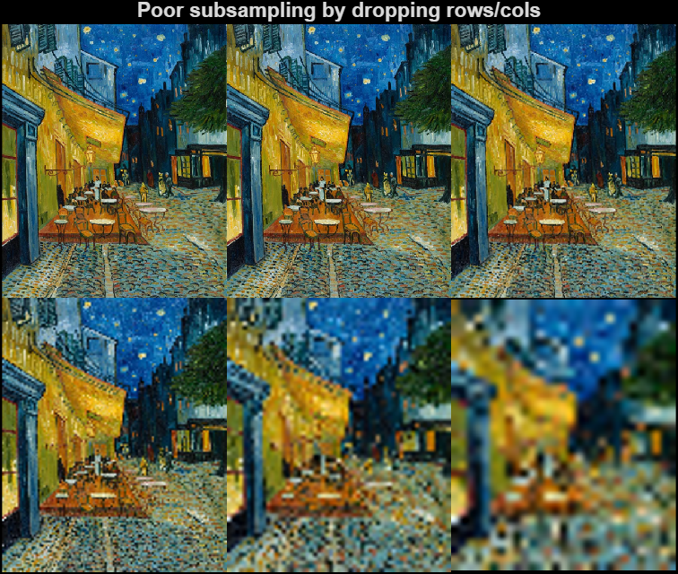 </p>
<p align="center"> 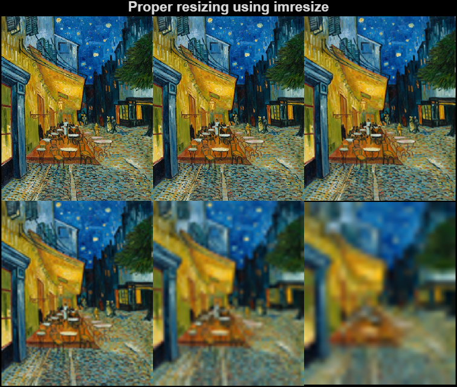 </p>

###### Explanation
Poor method: directly subsampling the image.
​-> As scale decreases, aliasing and jagged/moire patterns will appear, especially around high‑frequency details.

Good method: applies a low‑pass (Gaussian) filter before subsampling, so edges look smoother and aliasing artifacts are reduced
-> ​At very small scales both methods lose detail, but the imresize versions look more visually consistent and less noisy.

##### His Solution
```
clear all; close all;
f0 = imread('assets/cafe_van_gogh.jpg');

% Decimation by dropping samples & display
f1 = f0(1:2:end,1:2:end,:);
f2 = f1(1:2:end,1:2:end,:);
f3 = f2(1:2:end,1:2:end,:);
f4 = f3(1:2:end,1:2:end,:);
f5 = f4(1:2:end,1:2:end,:);
figure(1)
montage({f0,f1,f2,f3,f4,f5},'Size',[2 3]);
title('Wrong way of subsampling', 'FontSize', 14);

% Use imresize which first filter the image before dropping samples
f_1 = imresize(f0, 0.5);
f_2 = imresize(f_1, 0.5);
f_3 = imresize(f_2, 0.5);
f_4 = imresize(f_3, 0.5);
f_5 = imresize(f4, 0.5);
figure(2)
montage({f0,f_1,f_2,f_3,f_4,f_5},'Size',[2 3]);
title('Correct way of subsampling', 'FontSize', 14);

% Compare original with level 4 image
figure(3)
imshow(f0)
title('Original Image', 'FontSize', 14);
figure(4)
imshow(f_3);
title('1/8 image (filtered)', 'FontSize', 11);
figure(5)
imshow(f3);
title('1/8 image (drop samples)', 'FontSize', 11);
```
<p align="center"> 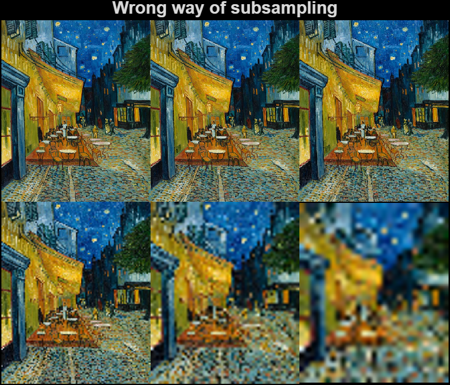 </p>
<p align="center"> 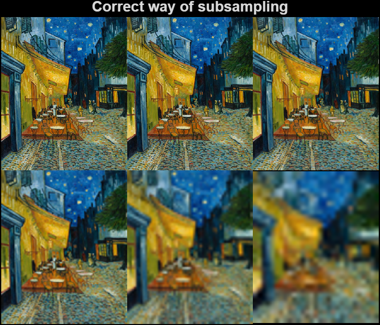 </p>
<p align="center"> 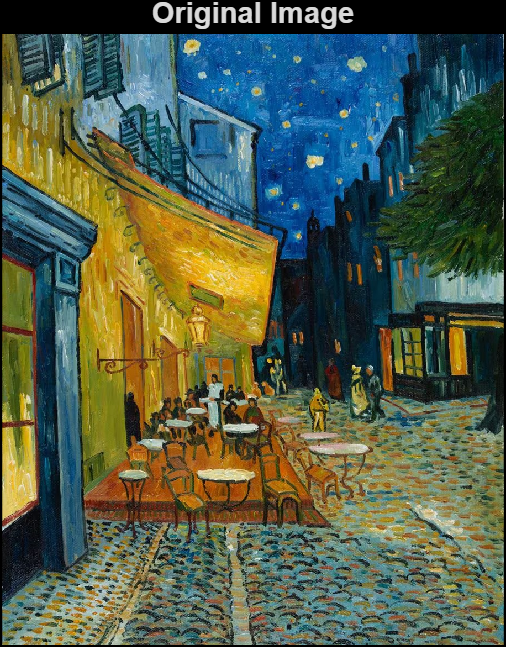 </p>
<p align="center"> 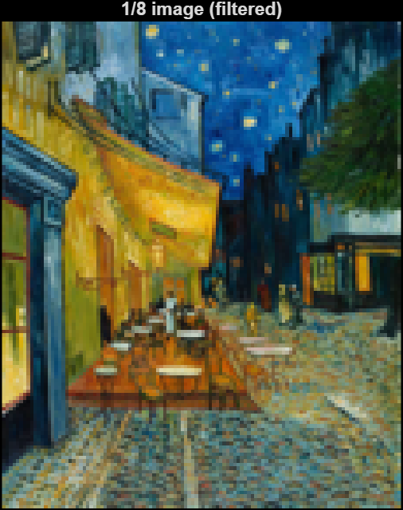 </p>
<p align="center"> 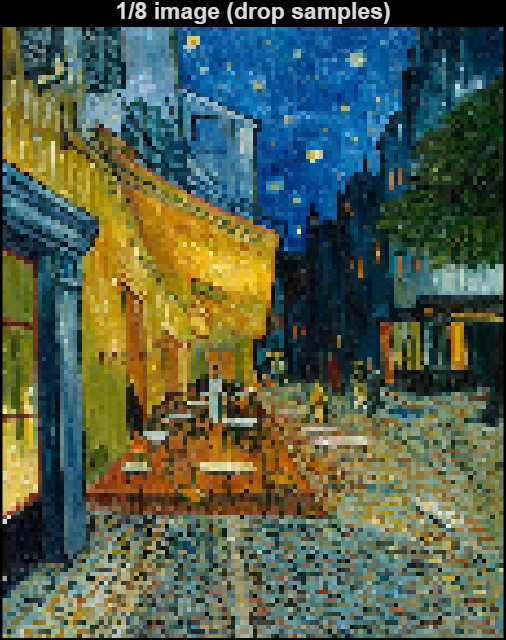 </p>


## Task 2: Pattern Matching with Normalized Cross Correlation

In this task, we will examine how to use Matlab's normalized cross correlation (NCC) function **_normxcorr2( )_** to match a template in file **_'assets/template1.tif'_** to that of the image **_'salvador_grayscale.tif'_**.

The following code will compute the NCC function and plot it as a 3D plot:

```
clear all; close all;
f = imread('assets/salvador_grayscale.tif');
w = imread('assets/template2.tif');
c = normxcorr2(w, f);
figure(1)
surf(c)
shading interp
```

>Try this code and explore the NCC plot between the template and the image.  You should be able manually locate the position of the template from the plot. This will be the location where the normalized cross correlation value = 1.0, i.e. an exact match.

Now we want to detect the peak location automatically. This is achieve with:

```
[ypeak, xpeak] = find(c==max(c(:)));
yoffSet = ypeak-size(w,1);
xoffSet = xpeak-size(w,2);
figure(2)
imshow(f)
drawrectangle(gca,'Position', ...
    [xoffSet,yoffSet,size(w,2),size(w,1)], 'FaceAlpha',0);
```

>Find out for yourself what the Matlab function **_find( )_** does.  Comment on the results.
>
>Test this procedure again with the second template image **_'template2.tif'_**.

It is clear that NCC can only match a template to an image if the match is exact or nearly exact.

#### Answers

```
clear; close all; clc;

f = imread('salvador_grayscale.tif');
w = imread('template1.tif');   % using template1
c = normxcorr2(w, f);

figure(1);
surf(c);
shading interp;
title('NCC between template1 and image');

figure(1);
surf(c);
shading interp;
title('NCC between template1 and image');

[ypeak, xpeak] = find(c == max(c(:)));
yoffSet = ypeak - size(w,1);
xoffSet = xpeak - size(w,2);

figure(2);
imshow(f);
hold on;
drawrectangle(gca, 'Position', ...
    [xoffSet, yoffSet, size(w,2), size(w,1)], ...
    'FaceAlpha', 0);
title('Template match by NCC');
```
<p align="center"> 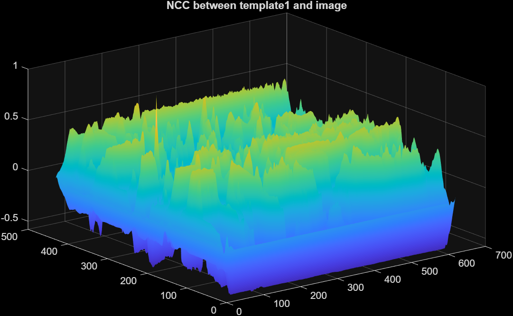 </p>
<p align="center"> 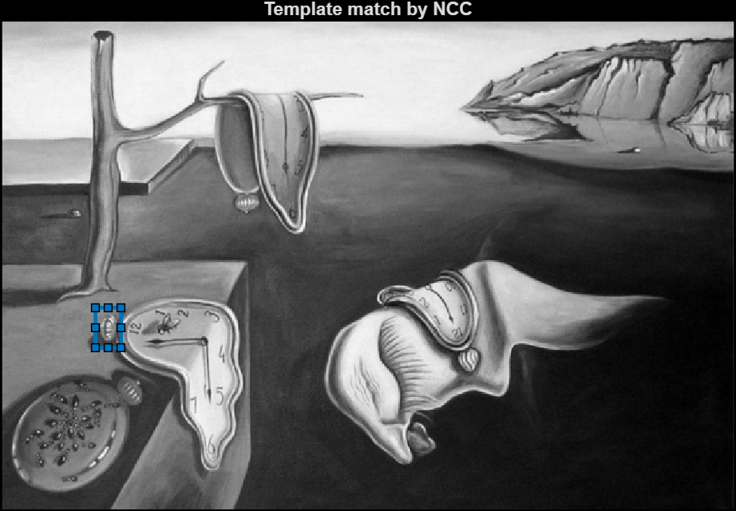 </p>

###### Explanation
-> template position is the sharp peak (highest point)

 Find function:
-> returns indices of all elements where the condition is true; here it returns row and column of the maximum value in c.
​-> Using c == max(c(:)), gives the coordinates of the global maximum NCC value (best match) from which offsets are computed

```
clear; close all; clc;

f = imread('salvador_grayscale.tif');
w = imread('template2.tif');   % using template2
c = normxcorr2(w, f);

figure(1);
surf(c);
shading interp;
title('NCC between template1 and image');

figure(1);
surf(c);
shading interp;
title('NCC between template1 and image');

[ypeak, xpeak] = find(c == max(c(:)));
yoffSet = ypeak - size(w,1);
xoffSet = xpeak - size(w,2);

figure(2);
imshow(f);
hold on;
drawrectangle(gca, 'Position', ...
    [xoffSet, yoffSet, size(w,2), size(w,1)], ...
    'FaceAlpha', 0);
title('Template match by NCC');
```
<p align="center"> 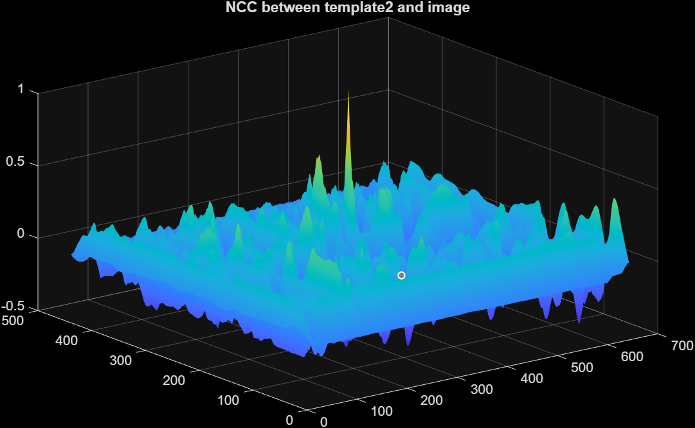 </p>
<p align="center"> 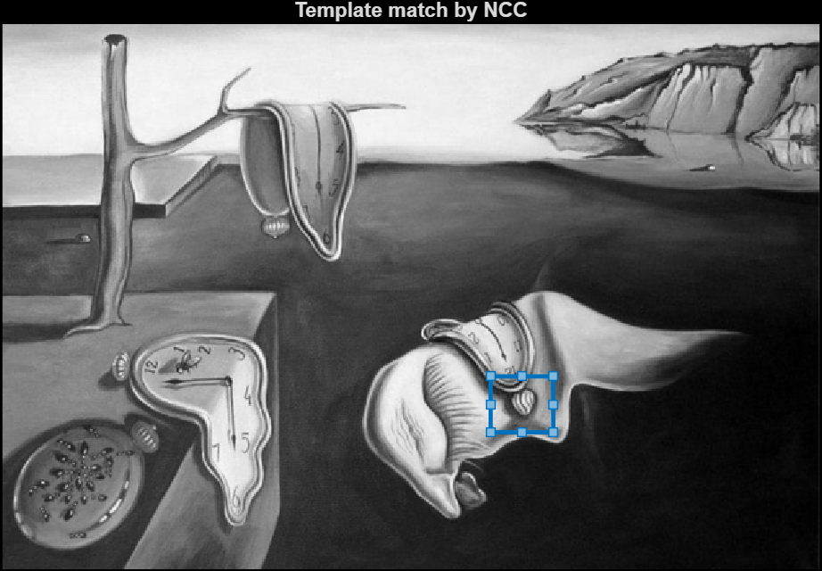 </p>

###### Explanation
Comments:

-> The rectangle tightly surrounds the true template location when the template exists with same scale and orientation.
​-> Repeating will show good localization only when the template is very similar; if appearance differs, peak correlation is lower and localization worsens, illustrating NCC’s sensitivity to exact appearance.


## Task 3: SIFT Feature Detection

Let us now try to apply the SIFT detector provided by Matlab through the function **_detectSIFTFeastures( )_** on the Dali painting that we used in task 1.

```
clear all; close all;
I = imread('assets/salvador.jpg');
f = im2gray(I);
points = detectSIFTFeatures(f);
figure(1); imshow(I);
hold on;
plot(points.selectStrongest(100));
```
>Comment on the results.
>Explore and explain the contents of the data structure *_points_*.

>#### Answers

<p align="center"> 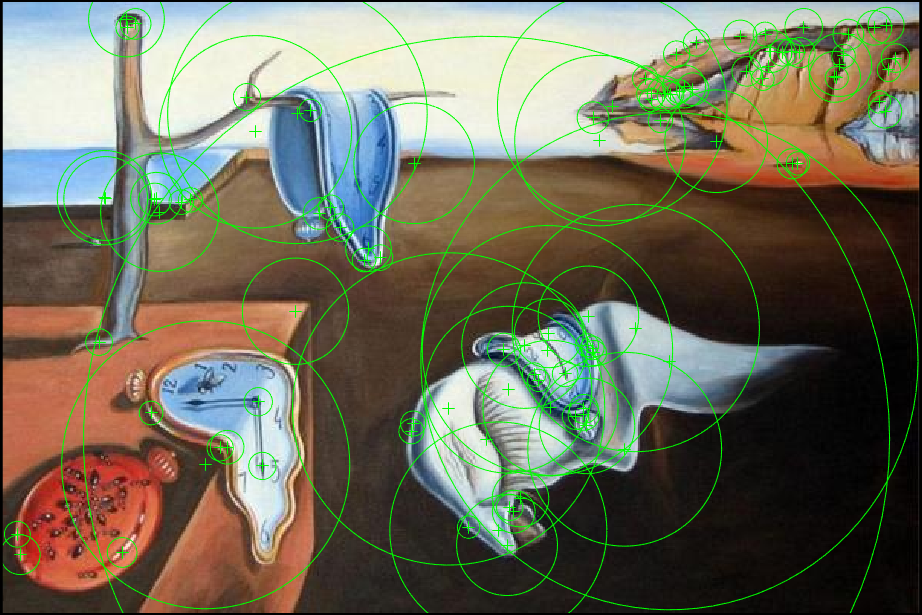 </p>

Comments:

-> The detected SIFT keypoints (green circles and crosses) concentrate on high‑contrast and textured regions such as the melting clocks, the tree trunk and the rocky structure on the right, while the smooth sky and flat ground have few or no points.
-> Many keypoints have different circle sizes, showing that SIFT is capturing features over multiple scales: small circles on fine details (clock markings, edges) and larger circles on bigger structures (the white cloth, large clock outlines) - scale invariance.
-> The distribution of points covers all main objects of interest in the painting, which means they are stable and repeatable across transformations.

Contents of the points data structure
In MATLAB, points is a SIFTPoints object array returned by detectSIFTFeatures. Each element (each keypoint) stores:
​-> Location – the (x,y) image coordinates of the keypoint, accessed with points(i).Location or points.Location for all of them.
-> Scale – the detected characteristic scale (rough “size” of the feature), accessed with points(i).Scale; this corresponds to the radius of the circles drawn in your plot.
-> Orientation – the dominant gradient direction at that point, accessed with points(i).Orientation; SIFT uses this to achieve rotation invariance.
-> Metric – a strength/contrast score indicating how “good” or distinctive that feature is; selectStrongest(N) uses this metric to keep the N most reliable keypoints.

You may want to consult this [Matlab page](https://uk.mathworks.com/help/vision/ref/siftpoints.html) about SIFT Interesting Points.

>Find the SIFT points for the image **_'cafe_van_gogh.jpg'_**.
>
> Explore  other methods of feature detection provided by Matlab provided in their toolboxes.

>#### Answers

```
clear; close all; clc;

I = imread('cafe_van_gogh.jpg');  % Van Gogh painting
f = im2gray(I);

pointsSIFT = detectSIFTFeatures(f);      % SIFT detector

figure;
imshow(I); hold on;
plot(pointsSIFT.selectStrongest(100));
title('Top 100 SIFT keypoints on cafe\_van\_gogh');

% SURF features
pointsSURF = detectSURFFeatures(f);

figure;
imshow(I); hold on;
plot(pointsSURF.selectStrongest(100));
title('Top 100 SURF keypoints on cafe\_van\_gogh');

% KAZE features
pointsKAZE = detectKAZEFeatures(f);

figure;
imshow(I); hold on;
plot(pointsKAZE.selectStrongest(100));
title('Top 100 KAZE keypoints on cafe\_van\_gogh');

% BRISK features
pointsBRISK = detectBRISKFeatures(f);

figure;
imshow(I); hold on;
plot(pointsBRISK.selectStrongest(100));
title('Top 100 BRISK keypoints on cafe\_van\_gogh');
```


<p align="center">  </p>
<p align="center"> 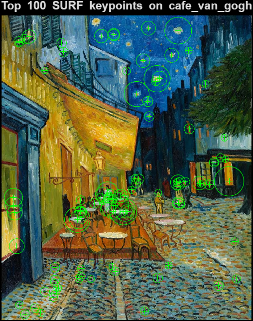 </p>
<p align="center"> 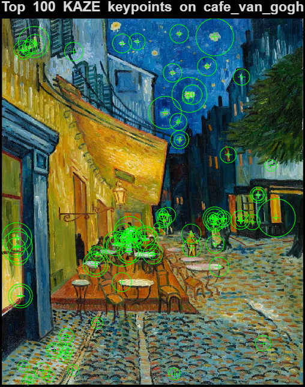 </p>
<p align="center"> 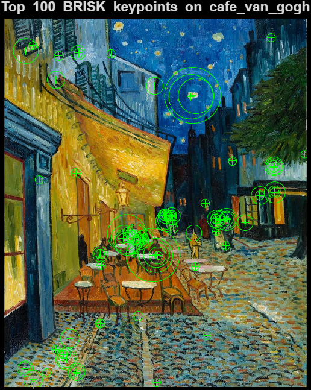 </p>


## Task 4: SIFT matching

We will now use SIFT features from two different scales of the same van Gogh painting to see how well SIFT manage to match the features that are of different scales (or sizes).

Run the following Matlab script:

```
clear all; close all;
I1 = imread('assets/cafe_van_gogh.jpg');
I2 = imresize(I1, 0.5);
f1 = im2gray(I1);
f2 = im2gray(I2);
points1 = detectSIFTFeatures(f1);
points2 = detectSIFTFeatures(f2);
Nbest = 100;
bestFeatures1 = points1.selectStrongest(Nbest);
bestFeatures2 = points2.selectStrongest(Nbest);
figure(1); imshow(I1);
hold on;
plot(bestFeatures1);
hold off;
figure(2); imshow(I2);
hold on;
plot(bestFeatures2);
hold off;
```

The code above finds the _Nbest_ features using SIFT in each iage and overlay the features as cicles onto the image.

>How successful do you think SIFT has managed to detect features for these two images (one is a quarter of the size of the other)?  What conclusions can you make?


>#### Answers

<p align="center"> 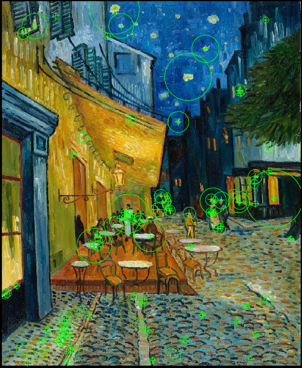 </p>
<p align="center"> 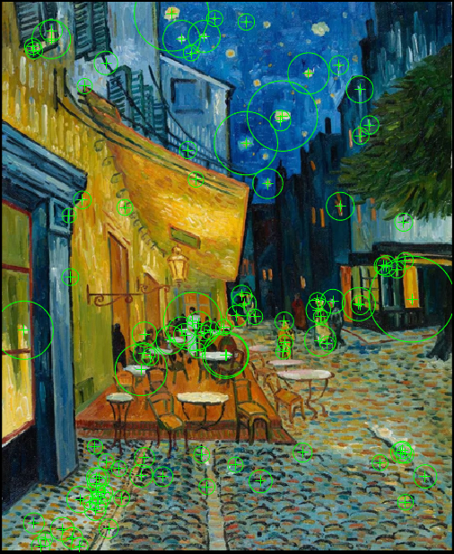 </p>

Comments:

-> SIFT has detected a very similar pattern of keypoints in both the original and the down‑scaled versions of the van Gogh painting: the strongest features cluster around the cafe facade table edges, window frames, cobblestones and bright stars in the sky. Although the second image is smaller, SIFT still finds points at corresponding visual structures, just with different circle radii, which reflects its built‑in scale invariance. This shows that SIFT can reliably locate stable, repeatable features across significant changes in image size, making these keypoints good candidates for later matching between different resolutions of the same scene.

## Task 4: SIFT matching - scale and rotation invariance

The arrays *_points1_* and *_points2_* contains the interest points in the two images.  We now want to match the best *_Nbest_* points between the two sets. This is achieved as below:

```
[features1, valid_points1] = extractFeatures(f1, points1);
[features2, valid_points2] = extractFeatures(f2, points2);

 indexPairs = matchFeatures(features1, features2, 'Unique', true);

 matchedPoints1 = valid_points1(indexPairs(:,1),:);
 matchedPoints2 = valid_points2(indexPairs(:,2),:);
 figure(3);
 showMatchedFeatures(f1,f2,matchedPoints1,matchedPoints2);
```

Comment on the results.

>#### Answers

<p align="center"> 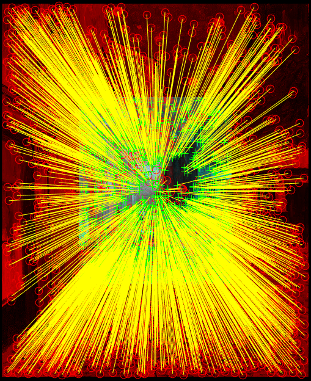 </p>

Comments:

-> The code matches a very large number of SIFT features between the two scales, showing strong scale invariance, but the visualisation is cluttered because every match is drawn, making it hard to visually inspect individual correspondences.

Now replace:
```
[features1, valid_points1] = extractFeatures(f1, points1);
```
with:
```
[features1, valid_points1] = extractFeatures(f1, bestFeatures1);
```
Comment on the results.


>#### Answers

<p align="center"> 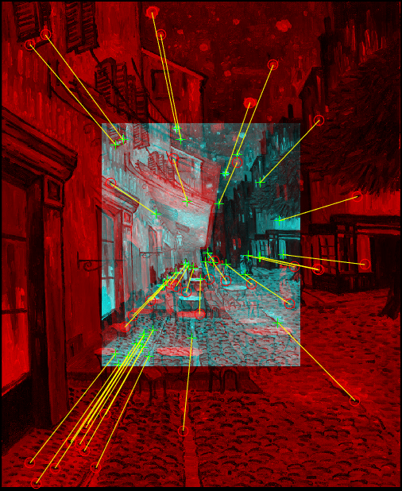 </p>

Comments:

-> Using SIFT on the original and scaled images, the matcher finds a set of clear correspondences that mostly lie on meaningful structures such as the cafe facade, windows, tables, and the cobblestone street. The yellow lines radiating from the smaller, central image to the larger background image show that many features are consistently detected at both scales and correctly linked, confirming SIFT’s ability to provide strong scale‑invariant matches across the scene.


>Next, rotate the smaller image by 20 degrees using the Matlab function **_imrotate( )_** and show that indeed SIFT is rotation invariant.

> #### Answers
<p align="center"> 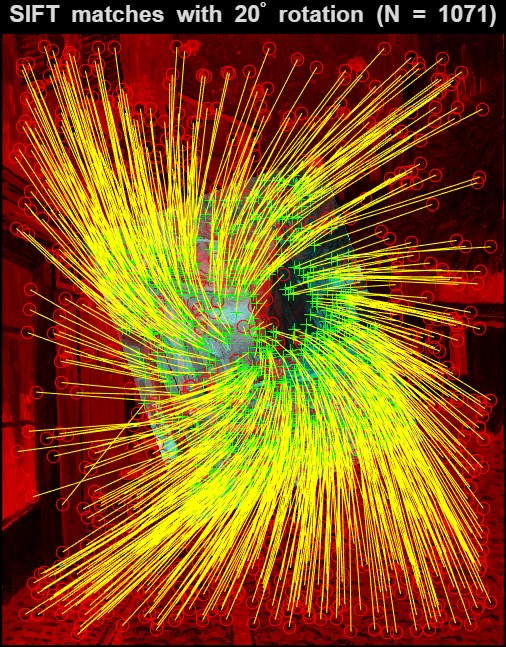 </p>
<p align="center"> 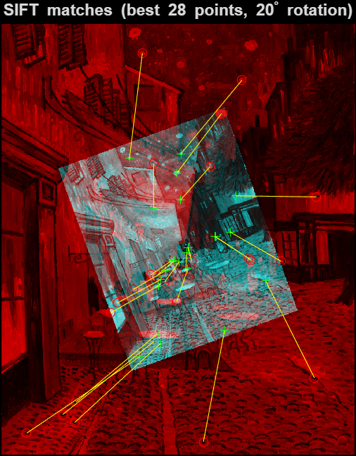 </p>

```
 clear; close all; clc;

% Original and scaled images
I1 = imread('cafe_van_gogh.jpg');
I2 = imresize(I1, 0.5);

f1 = im2gray(I1);
f2 = im2gray(I2);

points1 = detectSIFTFeatures(f1);
points2 = detectSIFTFeatures(f2);

Nbest = 100;
bestFeatures1 = points1.selectStrongest(Nbest);
bestFeatures2 = points2.selectStrongest(Nbest);

% --- show SIFT points on both images (as in handout) ---
figure(1); imshow(I1);
hold on; plot(bestFeatures1); hold off;
title('Top 100 SIFT points - original');

figure(2); imshow(I2);
hold on; plot(bestFeatures2); hold off;
title('Top 100 SIFT points - scaled');

% --- SIFT matching with rotation invariance test ---

% Rotate the smaller image by 20 degrees
I2_rot = imrotate(I2, 20);          % rotate scaled image
f2_rot = im2gray(I2_rot);

% Detect SIFT points in rotated image
points2_rot = detectSIFTFeatures(f2_rot);

% Extract features from original and rotated images
[features1,  valid_points1]  = extractFeatures(f1, points1);
[features2r, valid_points2r] = extractFeatures(f2_rot, points2_rot);

% Match features (unique matches)
indexPairs_rot = matchFeatures(features1, features2r, 'Unique', true);

matchedPoints1r = valid_points1(indexPairs_rot(:,1), :);
matchedPoints2r = valid_points2r(indexPairs_rot(:,2), :);

% Show matched features between original and rotated images
figure(3);
showMatchedFeatures(f1, f2_rot, matchedPoints1r, matchedPoints2r);
title(sprintf('SIFT matches with 20^\\circ rotation (N = %d)', ...
    size(indexPairs_rot,1)));

clear; close all; clc;

% Original and scaled images
I1 = imread('cafe_van_gogh.jpg');
I2 = imresize(I1, 0.5);

f1 = im2gray(I1);
f2 = im2gray(I2);

points1 = detectSIFTFeatures(f1);
points2 = detectSIFTFeatures(f2);

Nbest = 100;
bestFeatures1 = points1.selectStrongest(Nbest);
bestFeatures2 = points2.selectStrongest(Nbest);

% --- show SIFT points on both images (as in handout) ---
figure(1); imshow(I1);
hold on; plot(bestFeatures1); hold off;
title('Top 100 SIFT points - original');

figure(2); imshow(I2);
hold on; plot(bestFeatures2); hold off;
title('Top 100 SIFT points - scaled');

% --- Rotation invariance using BEST features only ---

% Rotate the smaller image by 20 degrees
I2_rot = imrotate(I2, 20);        % rotate scaled image
f2_rot = im2gray(I2_rot);

% Detect SIFT points in rotated image
points2_rot = detectSIFTFeatures(f2_rot);

% Select strongest N points in rotated image
bestFeatures2_rot = points2_rot.selectStrongest(Nbest);

% Extract features ONLY from strongest points
[features1,      valid_points1]      = extractFeatures(f1, bestFeatures1);
[features2_rot,  valid_points2_rot]  = extractFeatures(f2_rot, bestFeatures2_rot);

% Match features (unique matches)
indexPairs_rot = matchFeatures(features1, features2_rot, 'Unique', true);

matchedPoints1r = valid_points1(indexPairs_rot(:,1), :);
matchedPoints2r = valid_points2_rot(indexPairs_rot(:,2), :);

% Show matched features between original and rotated images
figure(3);
showMatchedFeatures(f1, f2_rot, matchedPoints1r, matchedPoints2r);
title(sprintf('SIFT matches (best %d points, 20^\\circ rotation)', ...
    size(indexPairs_rot,1)));
```

## Task 5: SIFT vs SURF

In addition to SIFT, there are other subsequently developed methods to detect features. These include:
* SURF
* KAZE
* BRISK
and others.  You will find these methods listed [here](https://uk.mathworks.com/help/vision/ug/local-feature-detection-and-extraction.html).

Let us now try to match two images from a video sequence of motorway traffic wtih cars moving bewteen frames.  The two still images are stored as *_'traffic_1.jpg'_* and *_'traffic_2.jpg'_*.  

>Use the same program in Task 4 to find the matching points between these two frames using SIFT.   Comment on the results.

>#### Answers

<p align="center"> 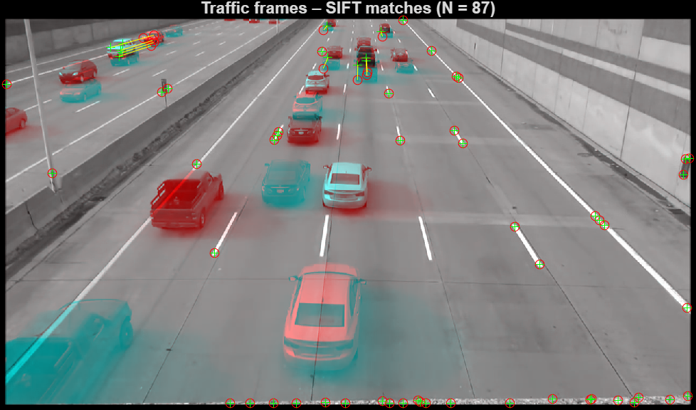 </p>

Comments:

-> Using SIFT on the two traffic images, the algorithm finds around reliable matches distributed across vehicles, lane markings and parts of the road surface. The red and cyan overlays on corresponding cars show that many keypoints are consistently tracked between frames, so SIFT provides a good basis for estimating vehicle motion and performing object tracking in this motorway sequence.

```
clear; close all; clc;

I1 = imread('traffic_1.jpg');
I2 = imread('traffic_2.jpg');

f1 = im2gray(I1);
f2 = im2gray(I2);

% --- SIFT detection ---
points1 = detectSIFTFeatures(f1);
points2 = detectSIFTFeatures(f2);

Nbest = 200;
best1 = points1.selectStrongest(Nbest);
best2 = points2.selectStrongest(Nbest);

[features1, valid_points1] = extractFeatures(f1, best1);
[features2, valid_points2] = extractFeatures(f2, best2);

indexPairs = matchFeatures(features1, features2, 'Unique', true);

matchedPoints1 = valid_points1(indexPairs(:,1), :);
matchedPoints2 = valid_points2(indexPairs(:,2), :);

figure(1);
showMatchedFeatures(f1, f2, matchedPoints1, matchedPoints2);
title(sprintf('Traffic frames – SIFT matches (N = %d)', ...
    size(indexPairs,1)));


```

>Now change the algorithm from SIFT to SURF, and see what the differences in the results.

What you have just done is to apply SIFT and SURF feature detection to perform object tracking between successive frames in a video.

>#### Answers

<p align="center"> 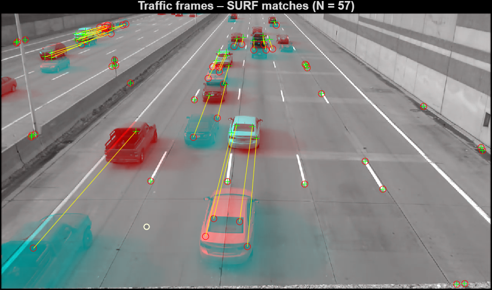 </p>

Comments:

-> Using SURF on the two traffic frames, the algorithm finds reliable matches concentrated on vehicle bodies, lane markings, and road barriers, with red/cyan overlays clearly highlighting the same cars in both images. The match lines show consistent displacements corresponding to vehicle motion, indicating that SURF features are stable enough between successive video frames to support object tracking in motorway scenes. Compared to SIFT (which found more matches), SURF produces a cleaner set of correspondences on larger, high‑contrast structures, making it a faster and potentially more efficient choice for real‑time applications.

```
clear; close all; clc;

I1 = imread('traffic_1.jpg');
I2 = imread('traffic_2.jpg');

f1 = im2gray(I1);
f2 = im2gray(I2);

% --- SURF detection (only this line changes) ---
points1 = detectSURFFeatures(f1);
points2 = detectSURFFeatures(f2);

Nbest = 200;
best1 = points1.selectStrongest(Nbest);
best2 = points2.selectStrongest(Nbest);

[features1, valid_points1] = extractFeatures(f1, best1);
[features2, valid_points2] = extractFeatures(f2, best2);

indexPairs = matchFeatures(features1, features2, 'Unique', true);

matchedPoints1 = valid_points1(indexPairs(:,1), :);
matchedPoints2 = valid_points2(indexPairs(:,2), :);

figure(2);
showMatchedFeatures(f1, f2, matchedPoints1, matchedPoints2);
title(sprintf('Traffic frames – SURF matches (N = %d)', ...
    size(indexPairs,1)));
```


## Task 6: Image recognition using neural networks

This task requires you to install a number of packages on Matlab beyond what you already have on your system.  You will be using either your laptop camera or, if you use an iPhone, use the camera on the iPhone.  For this task, you will need to install the camera support package for your machine (either Mac or PC).  You will also need to install the specific neural network model (e.g. AlexNet) onto your machines.

Enter the following:
```
% Lab 6 Task 6 
% Object recognition using webcam and various neural network models

camera = webcam;                            % create camera object for webcam
net = google;                               % change this for other networks
inputSize = net.Layers(1).InputSize(1:2);   % find neural network input size
figure 
I = snapshot(camera);      
image(I);
f = imresize(I, inputSize);                 % resize image to match network
tic;                                        % mark start time
[label, score] = classify(net,f);           % classify f with neural network net
toc                                         % report elapsed time
title({char(label), num2str(max(score),2)}); % label object
```

>#### Answers

<p align="center"> 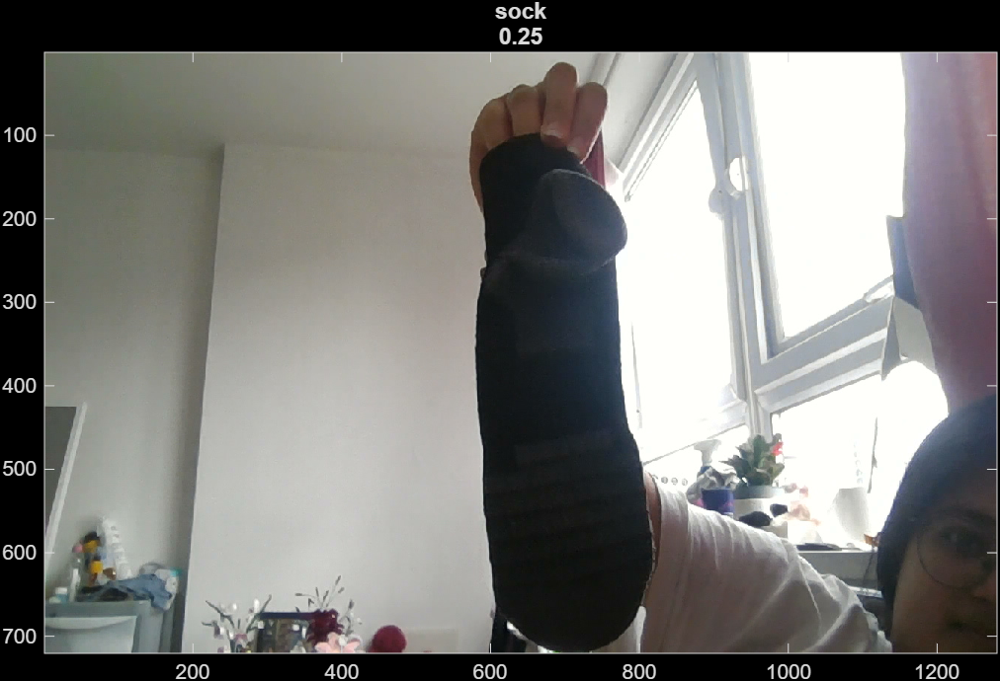 </p>


> Use the webcam to try to recognize different objects.  Also try to find the accuracy and speed of recogniture for different networks.

```
clear; close all; clc;

camera = webcam;  % default camera
networks = {'googlenet', 'alexnet'};
Ntest = 10;
times = zeros(length(networks), Ntest);
labels_cell = cell(length(networks), 1);
scores = zeros(length(networks), Ntest);

for n = 1:length(networks)
    netName = networks{n};
    net = feval(netName);
    inputSize = net.Layers(1).InputSize(1:2);
    
    fprintf('\n--- Testing %s (%dx%d) ---\n', netName, inputSize(1), inputSize(2));
    
    for i = 1:Ntest
        I = snapshot(camera);
        f = imresize(I, inputSize);
        
        tic;
        [label, score] = classify(net, f);
        times(n,i) = toc;
        
        labels_cell{n} = [labels_cell{n} char(label) ', '];
        scores(n,i) = max(score);
        
        fprintf('Frame %d: %s (conf %.2f, %.3f s)\n', i, label, scores(n,i), times(n,i));
    end
end

clear camera;

% Print simple summary (no table)
fprintf('\n=== SUMMARY ===\n');
for n = 1:length(networks)
    avgTime = mean(times(n,:));
    avgConf = mean(scores(n,:));
    fprintf('%s: avg time = %.3f s, avg conf = %.3f\n', ...
            networks{n}, avgTime, avgConf);
end

```

--- Testing googlenet (224x224) ---
Frame 1: syringe (conf 0.08, 0.196 s)
Frame 2: syringe (conf 0.08, 0.018 s)
Frame 3: plunger (conf 0.10, 0.017 s)
Frame 4: plunger (conf 0.12, 0.019 s)
Frame 5: plunger (conf 0.14, 0.020 s)
Frame 6: plunger (conf 0.16, 0.019 s)
Frame 7: plunger (conf 0.12, 0.020 s)
Frame 8: plunger (conf 0.13, 0.019 s)
Frame 9: plunger (conf 0.11, 0.018 s)
Frame 10: plunger (conf 0.13, 0.018 s)

--- Testing alexnet (227x227) ---
Frame 1: shower cap (conf 0.10, 0.285 s)
Frame 2: bathing cap (conf 0.09, 0.021 s)
Frame 3: shower cap (conf 0.10, 0.021 s)
Frame 4: shower cap (conf 0.09, 0.022 s)
Frame 5: shower cap (conf 0.10, 0.023 s)
Frame 6: shower cap (conf 0.10, 0.021 s)
Frame 7: shower cap (conf 0.10, 0.021 s)
Frame 8: shower cap (conf 0.10, 0.021 s)
Frame 9: shower cap (conf 0.10, 0.021 s)
Frame 10: shower cap (conf 0.10, 0.021 s)

=== SUMMARY ===
googlenet: avg time = 0.036 s, avg conf = 0.115
alexnet: avg time = 0.048 s, avg conf = 0.097


> Modify this code so that you capture and recognize object in a continous loop.
>

```
clear; close all; clc;

camera = webcam;
net = googlenet;                    % GoogLeNet
inputSize = net.Layers(1).InputSize(1:2);  % 224x224

figure;

for i = 1:300  % ~300 frames, Ctrl+C to stop
    I = snapshot(camera);
    f = imresize(I, inputSize);

    tic;
    [label, score] = classify(net, f);
    elapsedTime = toc;

    imshow(I); axis image off;
    title({char(label), ...
           ['Conf: ' num2str(max(score), 2) ...
            '  Time: ' num2str(elapsedTime, '%.3f') ' s']});
    
    drawnow;
end

clear camera;  % release webcam
```

You may also want to read and explore these online documents that accompany Matlab:

[Deep learning in Matlab](https://uk.mathworks.com/help/deeplearning/ug/deep-learning-in-matlab.html)

[Pretrained CNN](https://uk.mathworks.com/help/deeplearning/ug/pretrained-convolutional-neural-networks.html)
